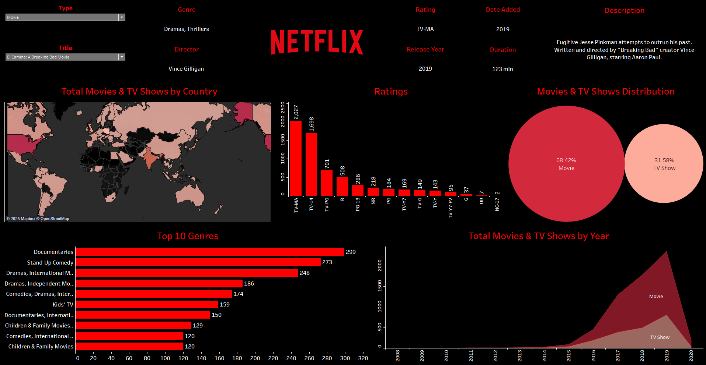

# Netflix Visual Analysis Dashboard 🎬📊

This project presents an interactive dashboard built using Tableau to explore and analyze Netflix's content library. It focuses on visualizing trends in content type, genre, country-wise distribution, and release history to derive insights from the platform's global catalog.

## Table of Contents

- [Description](#description)
- [Dataset](#dataset)
- [Installation](#installation)
- [Usage](#usage)
- [Contributing](#contributing)

## Description

The Netflix Visual Analysis Dashboard uses Tableau to visually explore how Netflix’s content has evolved over time. The dashboard provides answers to key questions around genre popularity, production countries, maturity ratings, and content distribution between movies and TV shows.

The dashboard helps answer questions like:

- What genres are most represented on Netflix?
- How has content output changed over the years?
- Which countries have the most Netflix titles?
- What is the split between Movies and TV Shows?
- What maturity ratings are most common?

## Dataset

The dataset used in this project is publicly available on [Kaggle - Netflix Movies and TV Shows](https://www.kaggle.com/datasets/shivamb/netflix-shows). It includes the following columns:

- `show_id`: Unique identifier for each title  
- `type`: Movie or TV Show  
- `title`: Name of the title  
- `director`: Director(s)  
- `cast`: Main cast  
- `country`: Country of origin  
- `date_added`: Date the title was added to Netflix  
- `release_year`: Year the title was released  
- `rating`: Maturity rating (e.g., TV-MA, PG-13)  
- `duration`: Runtime or number of seasons  
- `listed_in`: Genre or category  
- `description`: Short summary  

## Installation

To explore this dashboard locally:

1. Clone this repository:  
   `git clone https://github.com/AayushP-10/netflix-visual-analysis-dashboard.git`

2. Navigate to the folder:  
   `cd netflix-visual-analysis-dashboard`

3. Open Tableau Public or Tableau Desktop.

4. Load the dataset from the `data/` folder (`netflix_titles.csv`).

5. Open the Tableau workbook (`Netflix_Visual_Analysis.twbx`) to explore the dashboard.

## Usage

You can:

- Explore how content varies by country and genre
- Modify or extend the dashboard with new insights
- Customize visuals, filters, or calculations for your own use
- Use the structure as a reference for other entertainment-related datasets

## Dashboard Preview

🔗 **Live Dashboard**:  
[View on Tableau Public](https://public.tableau.com/app/profile/aayush.patil5835/viz/NetflixDashboard_17438066736050/Netflix)

